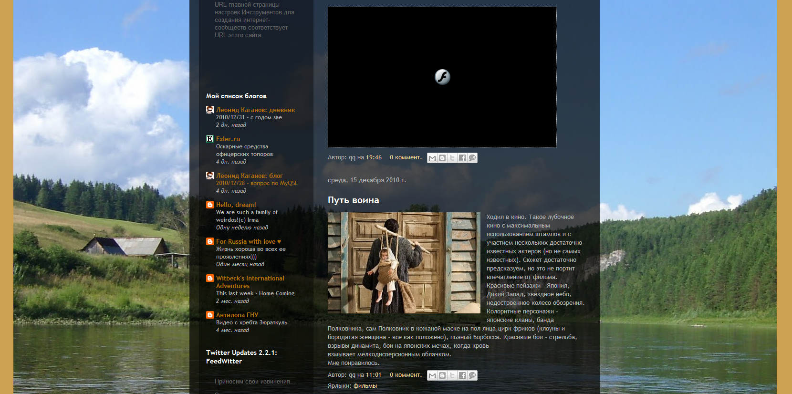

+++
title = "Новый год - с чистого листа"
description = "Выбрал простой дизайн - без фонов и ярких цветов. Пока пусть будет так. Upd. А вот так было."
image = "bsp.png"
date = "2011-01-11T04:41:00Z"
draft = false
tags = []
+++

Выбрал простой дизайн - без фонов и ярких цветов. Пока пусть будет так.

Upd. А вот так было.
