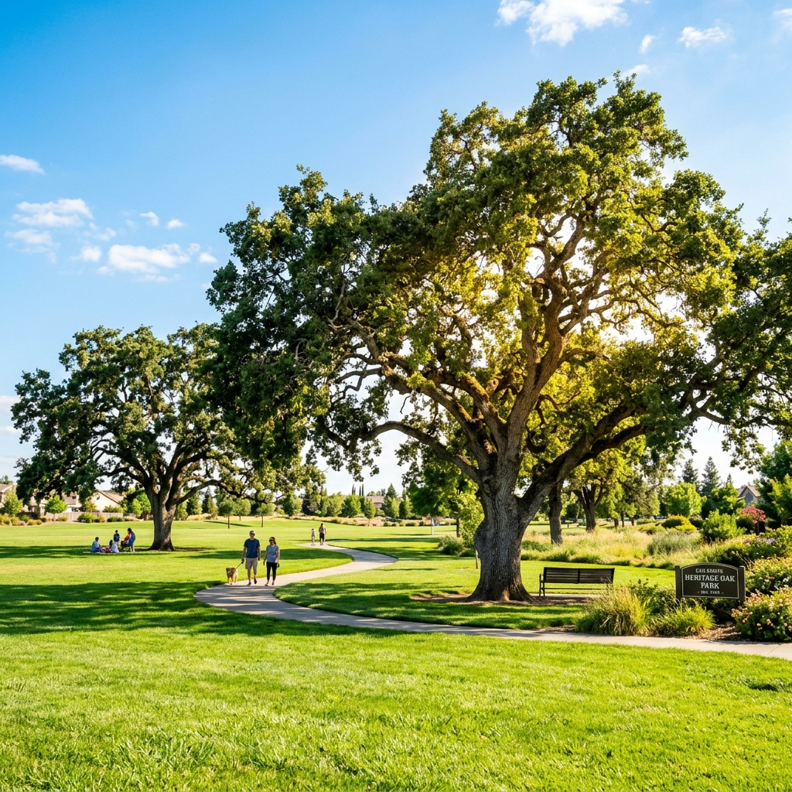

+++
title = "Летний зной в Элк-Гроув"
description = "Сегодня в Элк-Гроув настоящая калифорнийская жара под 95°F. Спасаемся в тени вековых дубов Heritage Oak Park."
date = "2026-06-14T18:20:00Z"
image = "weather.png"
draft = false
tags = ["путешествия", "места", "погода"]
+++

Сегодня в Элк-Гроув (Калифорния) выдался по-настоящему жаркий летний день. Столбик термометра днем поднялся почти до 95°F (около 35°C). Солнце палит нещадно, и на улицах в самый разгар дня практически никого не встретить — все прячутся под кондиционерами.

Однако ближе к вечеру, когда жара начнет спадать (ночью обещают прохладные 56°F / 13°C), будет идеальное время для прогулки. Одно из лучших мест для этого — **Elk Grove Regional Park** (а именно его часть **Heritage Oak Park**), где можно укрыться в тени величественных вековых дубов. Эти гигантские деревья растут здесь уже сотни лет и создают совершенно потрясающую прохладную атмосферу.

Лето в Калифорнии в самом разгаре! А какая погода у вас сегодня?
